# minikube-kubernetes-app-deployment


A personal portfolio page for **Sahana** (Aspiring SRE), containerized with Docker
and deployed on a local Kubernetes cluster using Minikube — built from scratch on Windows 11.

---

## Table of Contents

- [Overview](#overview)
- [Phase 1 — Install Tools](#phase-1--install-tools)
- [Phase 2 — Dockerize the App](#phase-2--dockerize-the-app)
- [Phase 3 — Deploy to Kubernetes](#phase-3--deploy-to-kubernetes)
- [Phase 4 — Push to GitHub](#phase-4--push-to-github)
- [Project Structure](#project-structure)
- [Run It Yourself](#run-it-yourself)
- [What I Learned](#what-i-learned)

---

## Overview

This project demonstrates a complete beginner-to-deployment workflow:

1. Install Docker, Minikube, and kubectl on Windows 11
2. Write a simple HTML portfolio page
3. Containerize it using Docker + Nginx
4. Deploy it to a local Kubernetes cluster using Minikube
5. Expose it via a Kubernetes NodePort Service

---

## Phase 1 — Install Tools

### Docker Desktop installed and running

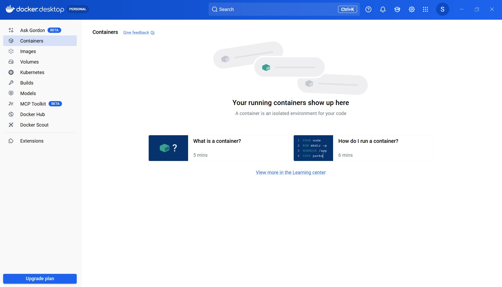

### Docker verified — hello-world container ran successfully

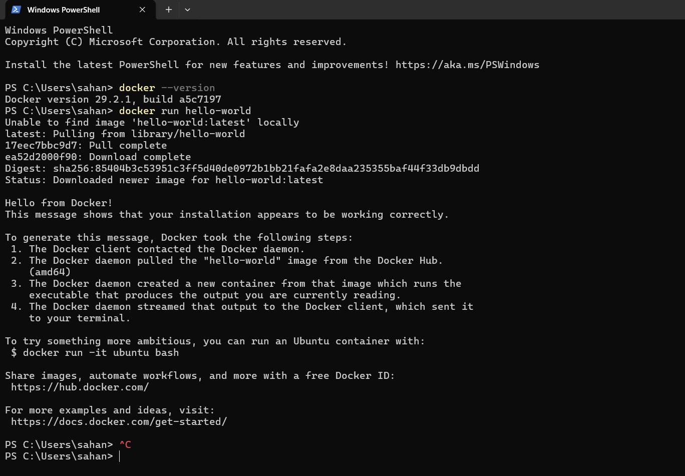

### Minikube installed

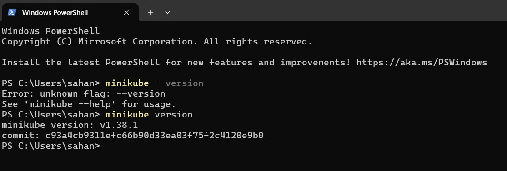

### kubectl installed

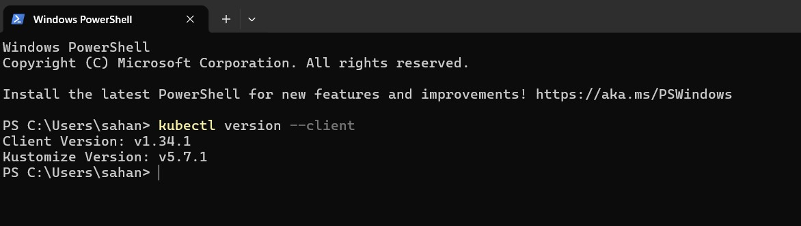

**Install commands used (Windows 11):**

```powershell
winget install Docker.DockerDesktop
winget install Kubernetes.minikube
winget install Kubernetes.kubectl
winget install Git.Git
```

---

## Phase 2 — Dockerize the App

### Project files created

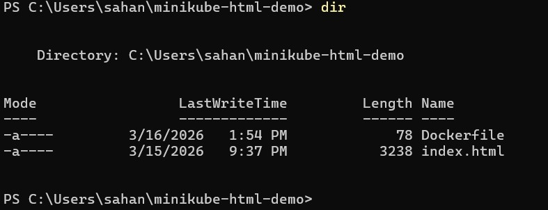

**Dockerfile:**

```dockerfile
FROM nginx:alpine
COPY index.html /usr/share/nginx/html/index.html
EXPOSE 80
```

### Docker image built

```powershell
docker build -t k8s-portfolio .
```

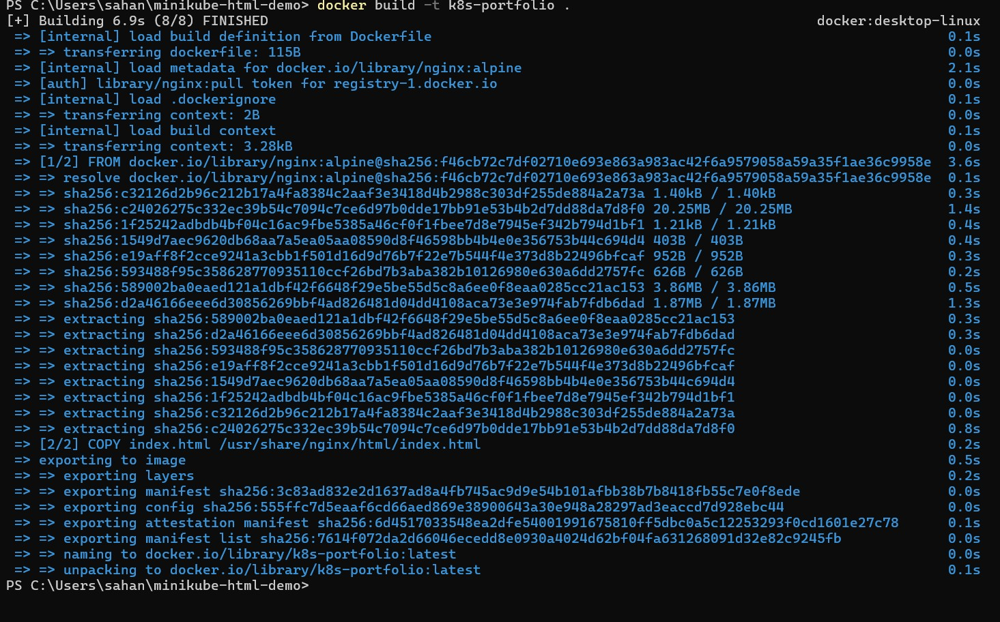

### Image confirmed in Docker

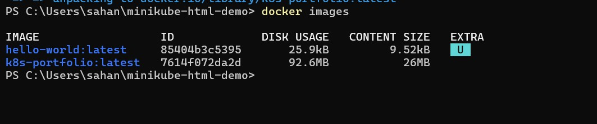

### Portfolio running locally in Docker (localhost:8080)

```powershell
docker run -d -p 8080:80 --name my-portfolio k8s-portfolio
```

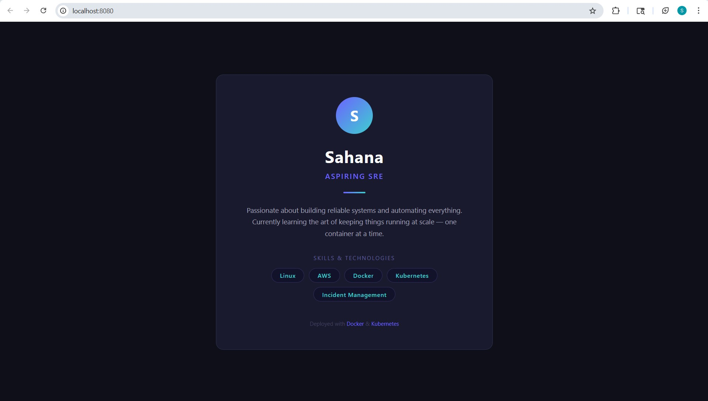

---

## Phase 3 — Deploy to Kubernetes

### Minikube cluster started

```powershell
minikube start --driver=docker
```

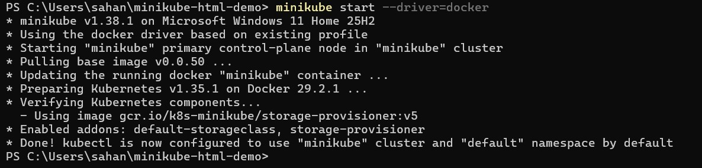

### Cluster node ready

```powershell
kubectl get nodes
```

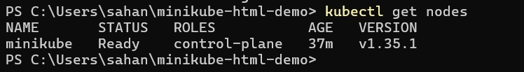

### Image loaded into Minikube

```powershell
minikube image load k8s-portfolio:latest
minikube image ls
```

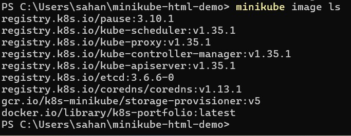

### All project files in place

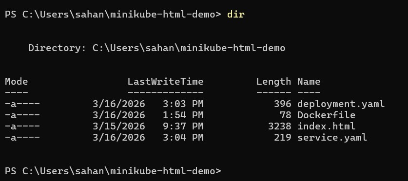

### Pods running — 2 replicas

```powershell
kubectl apply -f deployment.yaml
kubectl apply -f service.yaml
kubectl get pods
```

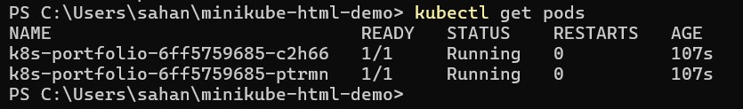

### Service exposed via NodePort

```powershell
kubectl get services
```

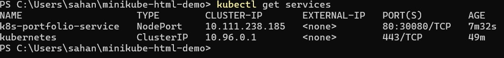

### Portfolio live via Kubernetes

```powershell
minikube service k8s-portfolio-service
```

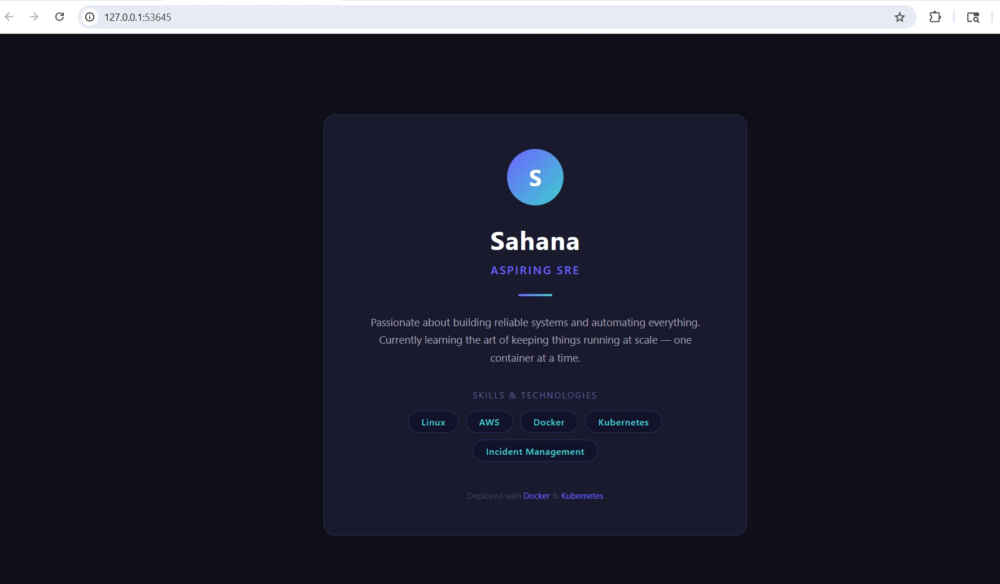

### Minikube Dashboard

```powershell
minikube dashboard
```

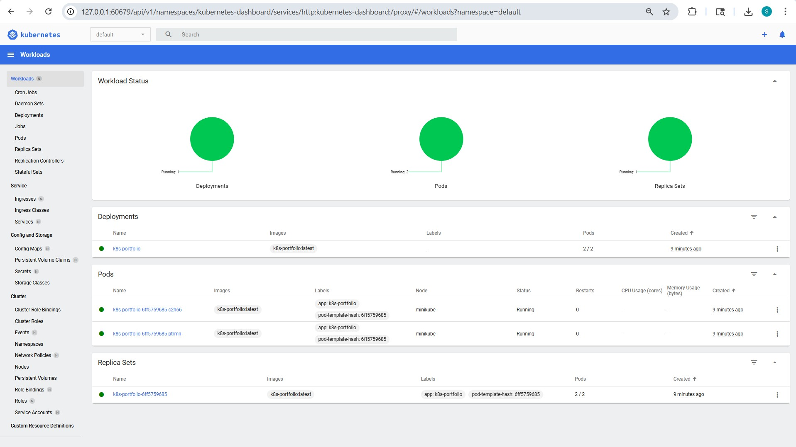

---

## Phase 4 — Push to GitHub

### Git installed


### Repository created


### Code pushed

```powershell
git init
git add .
git commit -m "Initial commit: Sahana portfolio deployed on Kubernetes"
git branch -M main
git remote add origin https://github.com/sahanaballullaya/minikube-kubernetes-app-deployment.git
git push -u origin main
```


### README live on GitHub


---

## Project Structure

```
minikube-kubernetes-app-deployment/
├── index.html              # Portfolio page — Sahana, Aspiring SRE
├── Dockerfile              # nginx:alpine base + HTML page
├── deployment.yaml         # Kubernetes Deployment — 2 replicas
├── service.yaml            # Kubernetes NodePort Service — port 30080
├── README.md
└── screenshots/            # Step-by-step proof of work (20 screenshots)
```

---

## Run It Yourself

### Prerequisites

| Tool | Version |
|------|---------|
| Docker Desktop | 29.2.1+ |
| Minikube | 1.38+ |
| kubectl | 1.34+ |
| Git | latest |

### Option A — Docker only (quickest)

```powershell
git clone https://github.com/sahanaballullaya/minikube-kubernetes-app-deployment.git
cd minikube-kubernetes-app-deployment
docker build -t k8s-portfolio .
docker run -d -p 8080:80 --name my-portfolio k8s-portfolio
# Open http://localhost:8080
```

### Option B — Full Kubernetes deployment

```powershell
git clone https://github.com/sahanaballullaya/minikube-kubernetes-app-deployment.git
cd minikube-kubernetes-app-deployment

# Start cluster
minikube start --driver=docker

# Build and load image
docker build -t k8s-portfolio .
minikube image load k8s-portfolio:latest

# Deploy to Kubernetes
kubectl apply -f deployment.yaml
kubectl apply -f service.yaml

# Wait for pods to be Running
kubectl get pods

# Open in browser
minikube service k8s-portfolio-service
```

---

## Useful Commands

```powershell
# See everything running in the cluster
kubectl get all

# Check pod logs
kubectl logs -l app=k8s-portfolio

# Scale to 3 replicas
kubectl scale deployment k8s-portfolio --replicas=3

# Open the Kubernetes dashboard
minikube dashboard

# Stop the cluster
minikube stop

# Clean up
kubectl delete -f deployment.yaml
kubectl delete -f service.yaml
```

---

## What I Learned

- How Docker containers work and how to write a Dockerfile
- Building and tagging a custom Docker image
- Kubernetes core concepts: Pods, Deployments, Services, ReplicaSets
- The difference between a Docker image and a running container
- Why `imagePullPolicy: Never` matters for local images
- Running a local Kubernetes cluster with Minikube on Windows 11
- Using `kubectl` to deploy, inspect, and manage workloads
- Exposing apps outside a cluster using NodePort services
- End-to-end workflow: code → container → Kubernetes → browser

---

*Sahana · Aspiring SRE · Deployed with Docker & Kubernetes*
